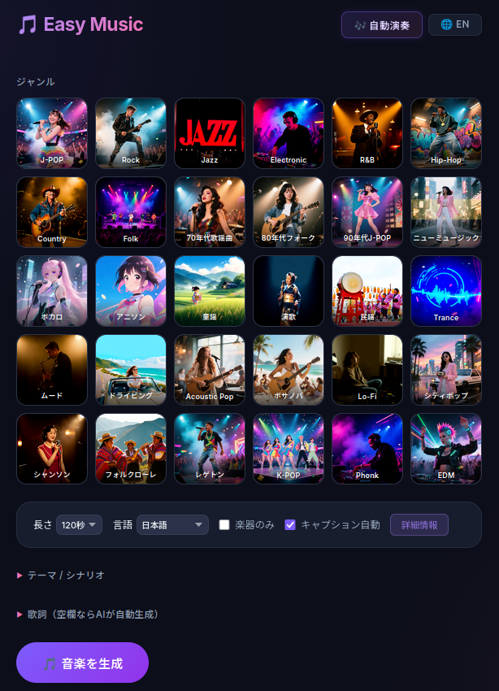

# Easy Music v1.7.0 — AI音楽生成アプリ

ジャンルを選んでワンクリックで音楽を生成するWebアプリケーション。  
[ACE-Step 1.5](https://github.com/ace-step/ACE-Step) を音楽生成エンジンとして使用します。

## 特徴

- 🎵 **30ジャンル対応** — J-POP、Rock、Jazz、EDMなど豊富なジャンルタイル
- 🤖 **AI作詞** — テーマに合わせた歌詞を自動生成
- 😊 **ムード/ボーカルチップ** — 10種のムードと6種のボーカルタイプをワンタップ指定
- 📝 **ローカルLLMフォールバック** — 外部LLM接続不可時はQwen3-1.7Bで自動切替
- 🏠️ **キャプション自動/手動** — ジャンル別の最適キャプション生成＋デバッグパネルで直接編集可
- 🎼 **AI強化** — BPM・キー自動設定
- 🧠 **Thinking モード** — ON/OFFでキャプション生成スタイルを切替
- 🎚️ **STEP選択** — 8/20/50/80/100ステップで品質と速度を調整
- 🔊 **インラインプレーヤー** — 10種のビジュアライザー + LLMムード連動配色
- 🖼️ **背景画像自動生成** — 音楽に合う背景画像を別サーバで生成し、再生時に自動表示
- 🔇 **無音音楽自動検出** — Web Audio APIでRMS/ピーク値を解析、無音生成を自動検出
- 📋 **履歴機能** — 直近10件の生成音楽をリスト表示、選択再生・ダウンロード（ブラウザsessionStorage）
- 🌐 **日英切替** — ワンクリックでUI言語切替

## v1.7.0 新機能

### 🖼️ 音楽連動の背景画像生成

音楽生成とは別サーバの画像生成APIを使い、曲のテーマ・歌詞・キャプション・ジャンルから再生用背景画像を自動生成します。

- **並列生成**: 音楽タスク作成直後に画像生成も開始し、待ち時間を短縮
- **再生時反映**: 画像生成が先に終わっていれば再生開始と同時に切替
- **後追い反映**: 音楽再生開始後に画像が完成した場合も、自動で差し替え
- **ジャンル反映**: `City Pop`、`Jazz`、`Rock` などはジャンルごとの視覚ヒントを画像プロンプトへ反映
- **履歴再利用**: 生成済み画像はキャッシュされ、履歴再生でも再利用

画像プロンプトは `momo_song-v3` の方式を参考に、LLMでシーン記述を生成した後に画像サーバへ送信します。

### 🎨 ビジュアライザームード（自動配色）

LLMが歌詞・ジャンルから曲の雰囲気を10カテゴリ（energetic / melancholic / healing / epic / cyber / romantic / dark / festive / nostalgic / mystical）に分類し、ビジュアライザーの色相・彩度・輝度・エフェクト強度・推奨モードを自動切替します。

### 🌟 新ビジュアライザーモード

5種→10種に拡張。新規追加: Aurora（オーロラ）/ Fireworks（花火）/ Matrix（マトリックス）/ Orbit（軌道）/ Fire（炎）

### 🎵 曲名自動生成

LLMが歌詞から曲名を推定し、オーバーレイと履歴に表示。

### 🎤 歌詞テロップ

エネルギー解析によるLRCタイミングでカラオケ風テロップ表示。4行ハイライト+スクロール。

---

## v1.6.1 機能

### 🏛️ XLモデル対応

起動時にサーバの `/v1/models` を問い合わせ、利用可能なモデルを動的にセレクタに表示します。

- **対応モデル**: TURBO / Base / XL TURBO / XL SFT
- **自動パラメータ調整**: モデルに応じて CFG・STEP・Batch上限を自動切替
- **SFT/Base**: guidance_scale 7.0、STEP 50、Batch 最大2
- **TURBO**: guidance_scale 3.0、STEP 8、Batch 制限なし

### 🪄 おまかせ生成 (Quick Generate)

「夏の海辺で聴きたい爽やかなポップ」のように自然言語で入力するだけで、AIがジャンル・キャプション・歌詞・BPM・キーなど全パラメータを自動決定して音楽を生成します。

- **使い方**: ジャンルタイルの上にある入力欄にテキストを入れて生成ボタンを押す
- **🎲 ランダムボタン**: 押すとランダムなキャプション・歌詞・設定をフォームに自動入力
- ACE-Stepの `sample_query` APIを使用し、LMが内部で全てを生成

### 🚫 ネガティブプロンプト (lm_negative_prompt)

生成時に「避けたい要素」を指定できます。画像生成AIのネガティブプロンプトと同じ考え方です。

- **デフォルト値** (空欄時自動適用): `low quality, noisy, distorted, muddy, clipping, off-key, out of tune, amateur, poorly mixed`
- **効果**: ノイズ、音割れ、音程外れ、低品質なミキシングを抑制し、全体的な音質を向上
- **カスタマイズ**: 作詞設定アコーディオン内の「ネガティブプロンプト」欄に自由入力可能

### ⚙️ 詳細設定 (アコーディオン)

コントロールバーが「基本設定」と「詳細設定」に分離され、初心者はシンプルに、上級者は細かく調整できます。

**基本設定** (常時表示):
- 長さ / 言語 / 曲数 / モデル / 楽器のみ

**詳細設定** (折りたたみ式):

| パラメータ | 説明 | 推奨値 |
|---|---|---|
| **STEP** | 推論ステップ数。多いほど高品質だが遅い | Turbo: 8, Base: 50 |
| **Shift** | タイムステップシフト。低い値=音質・ディテール重視、高い値=楽曲構造・プロンプト忠実度重視 | Turbo: 3.0, Base: 1.0〜2.0 |
| **Sampler** | ODE=安定・再現性◎、SDE=有機的・多様な質感（高ステップ推奨） | ODE |
| **キャプション自動** | ジャンル情報から最適なキャプションを自動生成 | ON |
| **Thinking** | LMのChain-of-Thought推論で品質向上 | ON |

#### Shift の詳細

フローマッチングのノイズスケジュールを制御します。

| 値 | 効果 | 向いている用途 |
|---|---|---|
| 1.0〜2.0 | ディテール段階に集中 → 細かい音質・テクスチャが精密 | 楽器の音色・ミキシングの繊細さ重視 |
| 3.0 | セマンティクス寄り → 構造がプロンプトに忠実 | Turbo推奨。ジャンル感・雰囲気重視 |
| 4.0〜5.0 | セマンティクス最大 → メロディ・リズムが強く制御 | 明確な構成を求める場合 |

#### Sampler (ODE / SDE) の詳細

| | ODE | SDE |
|---|---|---|
| 仕組み | 決定論的サンプリング | 確率的サンプリング（各ステップでノイズ再注入） |
| 再現性 | 同じseedで完全同一 | seedが同じでも微妙に異なる |
| 音の質感 | クリーン・整然 | 有機的・生演奏的な揺らぎ |
| 注意点 | 常に安定 | 少ステップ(8)では品質劣化リスクあり |
| 推奨環境 | Turbo (8ステップ) | Base (50+ステップ) |

### ⚡ パフォーマンス最適化

- **use_cot_metas 最適化**: `format_input` でBPM/Keyを取得済みの場合、生成時の重複メタデータ推定をスキップし、**1〜3秒の短縮**
- **Duration Auto**: デフォルトでLMが歌詞長から最適な曲の長さを自動推定

### 🔊 音量調整

全プレーヤー（インライン・オーバーレイ・JUKEBOX）に音量スライダーを搭載。スピーカーアイコンクリックでミュート/解除。音量設定はlocalStorageに保存され、次回アクセス時に復元されます。

## セットアップ

### 必要なもの

- Python 3.10+
- ACE-Step 1.5 APIサーバー（別途起動）
- LLM APIサーバー（オプション、OpenAI互換）
- 画像生成APIサーバー（オプション、背景画像生成用）

### インストール

```bash
# venv作成
python -m venv .venv
source .venv/bin/activate

# 依存パッケージ
pip install -r requirements.txt
```

### 起動

```bash
# デフォルト設定で起動
./start.sh

# ACE-Step APIを指定
./start.sh --ace-url http://YOUR_ACE_HOST:8001

# LLM APIを指定
./start.sh --llm-url http://YOUR_LLM_HOST:11434/v1

# 画像生成APIを指定
./start.sh --img-url http://YOUR_IMAGE_HOST:64656

# ポート変更
./start.sh --port 9000
```

ブラウザで `http://localhost:8889` にアクセス。

### ACE-Step サーバーの起動

Easy Music は ACE-Step 1.5 の REST API サーバーに接続して音楽を生成します。

#### 標準起動（公式コマンド）

ACE-Step リポジトリが提供する標準の起動方法です。

```bash
cd /path/to/ACE-Step-1.5

# 推奨（フォアグラウンド）
uv run acestep-api --host 0.0.0.0 --port 8001

# または手動で uvicorn を起動
python -m uvicorn acestep.api_server:app --host 0.0.0.0 --port 8001 --workers 1
```

- デフォルト: Turbo モデル、LM 有効
- 環境変数でモデルや設定を変更可能（`ACESTEP_CONFIG_PATH`, `ACESTEP_LM_MODEL_PATH` 等）
- `workers` は 1 固定（メモリ内キューのため）

#### マルチモデル起動（推奨）

用途に応じた起動スクリプトを `ace_startup/` に同梱しています。  
ACE-Step 1.5 のインストールフォルダにコピーして使用してください。

```bash
# ace_startup/ のスクリプトを ACE-Step フォルダにコピー
cp ace_startup/run_api_server_*.sh /path/to/ACE-Step-1.5/
```

Turbo と Base の両モデルを同時にロードし、リクエスト単位で切り替えられます。  
UI の「モデル」セレクタで Turbo/Base を選択すると自動的に対応モデルが使用されます。

```bash
cd /path/to/ACE-Step-1.5
./run_api_server_multimodel.sh
```

- デフォルト: Turbo（高速）、リクエストで `"model": "acestep-v15-base"` を送ると Base に切替
- LM: 4B（高品質）、バックエンド: vllm
- VRAM目安: 24GB 推奨

#### Low-VRAM 起動

VRAM が限られた環境向け。単一モデルのみロードし、CPU オフロードを有効化します。  
このモードではリクエスト単位のモデル切替はできません。

```bash
cd /path/to/ACE-Step-1.5
./run_api_server_lowvram.sh

# Base モデルで起動する場合
ACESTEP_CONFIG_PATH=acestep-v15-base ./run_api_server_lowvram.sh
```

- デフォルト: Turbo 単体
- LM: 1.7B（軽量）、CPU オフロード有効
- VRAM を他アプリと共有する場合に最適

> 詳細は `ace_startup/起動コマンド.md` および `ace_startup/運用メモ_同時実行数とキュー.md` を参照してください。

### サーバ版（マルチユーザー対応）

複数ユーザーが同時接続する環境でもそのまま使えます。  
タスクIDはACE-Step APIが生成するUUID（128-bit）であり、推測不可能なためセッション管理なしで安全に動作します。  
履歴はブラウザのsessionStorageに保存されます（タブごとに独立）。

```bash
# サーバ版で起動
./start_server.sh

# ACE-Step APIを指定
./start_server.sh --ace-url http://YOUR_ACE_HOST:8001

# 画像生成APIも指定
./start_server.sh --ace-url http://YOUR_ACE_HOST:8001 --img-url http://YOUR_IMAGE_HOST:64656
```

| 項目 | WEBアプリ版 (`start.sh`) | サーバ版 (`start_server.sh`) |
|------|------------------------|----------------------------|
| 同時接続 | 単一ユーザー向け | マルチユーザー対応 |
| 履歴 | sessionStorage | sessionStorage |
| 機能 | 同一 | 同一 |



### 環境変数 (.env)

```env
ACE_STEP_API_URL=http://localhost:8001
OPENAI_BASE_URL=http://localhost:11434/v1
OPENAI_API_KEY=YOUR_KEY
OPENAI_CHAT_MODEL=gemma3:latest
IMAGE_GENERATION_URL=http://192.168.5.73:64656
HOST=0.0.0.0
PORT=8889
```

### 背景画像生成サーバー

背景画像機能は `POST /generate/` を持つ画像生成サーバーを使用します。

- デフォルトURL: `http://192.168.5.73:64656`
- CLI引数:
	- `--img-url http://HOST:64656`
	- `--img-host HOST`
	- `--img-port 64656`
- 音楽生成とは独立しているため、音楽と画像を並列に生成できます

画像が少し遅れて完成した場合でも、再生中に自動で背景が更新されます。

## 構成

```
easy_music/
├── main.py                 # FastAPIアプリ（WEBアプリ版）
├── main_server.py          # サーバ版（ラッパー）
├── config.py               # 設定
├── requirements.txt
├── start.sh                # WEBアプリ版起動
├── start_server.sh         # サーバ版起動
├── routers/
│   ├── generate.py         # 音楽生成API（音声プロキシ付き）
│   └── lyrics.py           # 作詞/テーマ/キャプションAPI
├── services/
│   ├── ace_step_client.py  # ACE-Step APIクライアント
│   ├── llm_service.py      # 外部LLMサービス
│   └── local_llm_service.py # ローカルLLMフォールバック
├── templates/
│   └── index.html          # メインページ
├── static/
│   ├── app.js              # フロントエンドJS（無音検出・履歴含む）
│   ├── style.css           # スタイルシート
│   └── image/              # ジャンル画像
├── models/                 # GGUFモデル（自動ダウンロード）
├── ace_startup/            # ACE-Stepサーバー起動スクリプト・ドキュメント
└── docs/                   # ドキュメント
```

## ライセンス

MIT License
